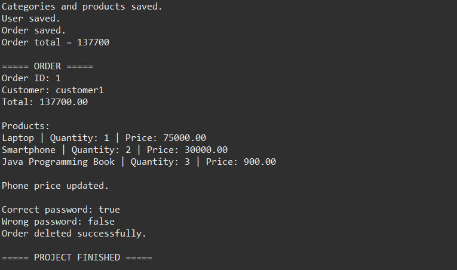
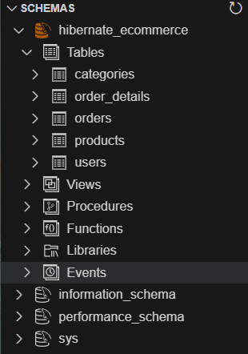

<div align="center">

# 🛒 Hibernate E-Commerce Management System

### Java • Hibernate ORM • JPA • MySQL • Maven • JUnit 5

**Developed by Anirban Ray**  
**B.Tech Computer Science & Engineering**


</div>

---

## 📌 About

This project is a Java-based **E-Commerce Management System** implemented using **Hibernate ORM, Jakarta JPA, Maven, and MySQL**.

It demonstrates object-relational mapping, entity relationships, CRUD operations, order management, database persistence, HQL-based data fetching, BCrypt password hashing, and JUnit testing.

---

## ✨ Features

- Category and product management
- User management with `ADMIN` and `CUSTOMER` roles
- Order creation with multiple order details
- Automatic order total calculation
- Hibernate `@OneToMany` and `@ManyToOne` relationships
- CRUD operations
- HQL-based order fetching
- MySQL database persistence
- BCrypt password hashing
- JUnit 5 testing
- Maven project configuration

---

## 🛠️ Technologies

| Technology | Purpose |
|---|---|
| Java 17 | Application development |
| Hibernate ORM | Object-relational mapping |
| Jakarta JPA 3.1 | Entity mapping |
| MySQL | Database |
| Maven | Dependency management |
| BCrypt | Password hashing |
| JUnit 5 | Testing |
| Eclipse IDE | Development |

---

## 🧩 Entity Relationships

| Entity | Relationship | Entity |
|---|---|---|
| Category | One-to-Many | Product |
| Product | Many-to-One | Category |
| Users | One-to-Many | Orders |
| Orders | Many-to-One | Users |
| Orders | One-to-Many | OrderDetails |
| OrderDetails | Many-to-One | Orders |
| OrderDetails | Many-to-One | Product |

### Relationship Flow

```text
Category
   │
   └── 1 : Many ──> Product
                         │
                         └── 1 : Many ──> OrderDetails
                                              │
                                              └── Many : 1 ──> Orders
                                                                    │
                                                                    └── Many : 1 ──> Users
```

---

## 📂 Project Structure

```text
HibernateEcommerce/
│
├── src/
│   │
│   ├── main/
│   │   │
│   │   ├── java/
│   │   │   └── com/
│   │   │       └── ecommerce/
│   │   │           │
│   │   │           ├── entity/
│   │   │           │   ├── Category.java
│   │   │           │   ├── Product.java
│   │   │           │   ├── Users.java
│   │   │           │   ├── Orders.java
│   │   │           │   ├── OrderDetails.java
│   │   │           │   └── Role.java
│   │   │           │
│   │   │           ├── util/
│   │   │           │   ├── HibernateUtil.java
│   │   │           │   └── PasswordUtil.java
│   │   │           │
│   │   │           └── App.java
│   │   │
│   │   └── resources/
│   │       └── hibernate.cfg.xml
│   │
│   └── test/
│       └── java/
│           └── com/
│               └── ecommerce/
│                   └── CrudTest.java
│
├── database/
│   └── schema.sql
│
├── screenshots/
│   ├── application-output.png
│   ├── mysql-tables.png
│   ├── junit-test.png
│   └── project-structure.png
│
├── pom.xml
├── README.md
└── .gitignore
```

---

## 🧱 Main Components

### `entity`

Contains the Hibernate entities:

- `Category` — product category information
- `Product` — product name, price, stock, and category
- `Users` — username, email, password, and role
- `Orders` — customer order and total amount
- `OrderDetails` — products, quantities, and unit prices
- `Role` — user role definition

### `util`

- `HibernateUtil.java` — Hibernate `SessionFactory` configuration
- `PasswordUtil.java` — BCrypt hashing and verification

### `App.java`

Main class used to demonstrate the application workflow including data creation, order creation, order fetching, product update, password verification, and order deletion.

### `CrudTest.java`

JUnit 5 test class for password hashing and password verification.

---

# 📸 Project Screenshots

## 1. Application Output

The application demonstrates the complete Hibernate workflow, including category/product creation, user creation, order creation, order fetching, product update, password verification, and order deletion.

<p align="center">
  
</p>

---

## 2. MySQL Database

The project stores its e-commerce data in MySQL.

<p align="center">
  
</p>

Main database tables:

```text
categories
products
users
orders
order_details
```

---

## 🛒 Order Management

A single order can contain multiple products through `OrderDetails`.

Example:

```text
Order
 ├── Laptop × 1
 ├── Smartphone × 2
 └── Java Programming Book × 3
```

The order total is calculated as:

```text
Order Total = Σ (Quantity × Unit Price)
```

---

## 🔄 CRUD Operations

The application demonstrates:

**Create**

```text
Categories
Products
Users
Orders
OrderDetails
```

**Read**

```text
Orders
Users
Products
OrderDetails
```

**Update**

```text
Product price
```

**Delete**

```text
Orders
OrderDetails through relationship management
```

---

## 🔐 Security

Passwords are protected using **BCrypt hashing** rather than plain-text storage.

```text
Plain Password
      │
      ▼
BCrypt Hashing
      │
      ▼
Hashed Password
```

The application also verifies both valid and invalid passwords.

```text
Correct password: true
Wrong password: false
```

---

## 🗄️ Database

**Database:** `hibernate_ecommerce`

**Schema:**

```text
database/schema.sql
```

**Hibernate configuration:**

```text
src/main/resources/hibernate.cfg.xml
```

The project uses Hibernate schema update:

```xml
<property name="hibernate.hbm2ddl.auto">update</property>
```

---

## 🚀 How to Run

#### Requirements

- Java 17
- Maven
- MySQL
- Eclipse / IntelliJ IDEA / VS Code

#### Clone the Repository

```bash
git clone https://github.com/AnirbanRay26/HibernateEcommerce.git
cd HibernateEcommerce
```

#### Configure MySQL

Open:

```text
src/main/resources/hibernate.cfg.xml
```

Configure your local MySQL username and password.

> Keep database credentials private and do not commit them to GitHub.

#### Build the Project

```bash
mvn clean install
```

#### Run the Application

Run:

```text
src/main/java/com/ecommerce/App.java
```

#### Run Tests

```bash
mvn test
```

---

# 👨‍💻 Author

**Anirban Ray**

**B.Tech Computer Science & Engineering**

**Hibernate E-Commerce Management System**

[GitHub Profile](https://github.com/AnirbanRay26)

[Project Repository](https://github.com/AnirbanRay26/HibernateEcommerce)

</div>